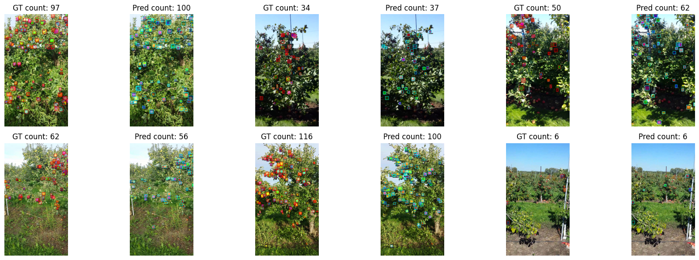

# Detectron2 MinneApple Segmentation using CenterMask2

## 🍎🍏 MinneApple Dataset 

[](https://www.python.org)
[](https://pytorch.org)


This repository contains a instance segmentation project focused on **counting on apples** with **binary segmentation** using **CenterMask2**.

---

## 🧭 Dataset Overview

The dataset includes the following apples annotations for instance segmentation:

Train images: 536
Train annotations: 22595
Categories: [{'id': 1, 'name': 'apple', 'supercategory': 'fruit'}]

Valid images: 134
Valid annotations: 5582
Categories: [{'id': 1, 'name': 'apple', 'supercategory': 'fruit'}]

---

## 🏗️ Model Architecture

- 🔷 Model: **CenterMask2**
- 🔷 Size: **"V_39_eSE_FPN"**
- 🔷 Framework: **PyTorch + Detectron2**
- 🔷 Input Size: **1280**
- 🔷 Trained Epochs: **16**

---

## 📊 Final Performance
```
 Average Precision  (AP) @[ IoU=0.50:0.95 | area=   all | maxDets=100 ] = 0.357
 Average Precision  (AP) @[ IoU=0.50      | area=   all | maxDets=100 ] = 0.759
 Average Precision  (AP) @[ IoU=0.75      | area=   all | maxDets=100 ] = 0.279
 Average Precision  (AP) @[ IoU=0.50:0.95 | area= small | maxDets=100 ] = 0.362
 Average Precision  (AP) @[ IoU=0.50:0.95 | area=medium | maxDets=100 ] = 0.404
 Average Precision  (AP) @[ IoU=0.50:0.95 | area= large | maxDets=100 ] = -1.000
 Average Recall     (AR) @[ IoU=0.50:0.95 | area=   all | maxDets=  1 ] = 0.016
 Average Recall     (AR) @[ IoU=0.50:0.95 | area=   all | maxDets= 10 ] = 0.131
 Average Recall     (AR) @[ IoU=0.50:0.95 | area=   all | maxDets=100 ] = 0.443
 Average Recall     (AR) @[ IoU=0.50:0.95 | area= small | maxDets=100 ] = 0.435
 Average Recall     (AR) @[ IoU=0.50:0.95 | area=medium | maxDets=100 ] = 0.523
 Average Recall     (AR) @[ IoU=0.50:0.95 | area= large | maxDets=100 ] = -1.000
[07/16 17:36:21 d2.evaluation.coco_evaluation]: Evaluation results for bbox: 
|   AP   |  AP50  |  AP75  |  APs   |  APm   |  APl  |
|:------:|:------:|:------:|:------:|:------:|:-----:|
| 35.738 | 75.887 | 27.909 | 36.191 | 40.426 |  nan  |
 Average Precision  (AP) @[ IoU=0.50:0.95 | area=   all | maxDets=100 ] = 0.216
 Average Precision  (AP) @[ IoU=0.50      | area=   all | maxDets=100 ] = 0.641
 Average Precision  (AP) @[ IoU=0.75      | area=   all | maxDets=100 ] = 0.058
 Average Precision  (AP) @[ IoU=0.50:0.95 | area= small | maxDets=100 ] = 0.213
 Average Precision  (AP) @[ IoU=0.50:0.95 | area=medium | maxDets=100 ] = 0.313
 Average Precision  (AP) @[ IoU=0.50:0.95 | area= large | maxDets=100 ] = -1.000
 Average Recall     (AR) @[ IoU=0.50:0.95 | area=   all | maxDets=  1 ] = 0.012
 Average Recall     (AR) @[ IoU=0.50:0.95 | area=   all | maxDets= 10 ] = 0.093
 Average Recall     (AR) @[ IoU=0.50:0.95 | area=   all | maxDets=100 ] = 0.286
 Average Recall     (AR) @[ IoU=0.50:0.95 | area= small | maxDets=100 ] = 0.269
 Average Recall     (AR) @[ IoU=0.50:0.95 | area=medium | maxDets=100 ] = 0.460
 Average Recall     (AR) @[ IoU=0.50:0.95 | area= large | maxDets=100 ] = -1.000
[07/16 17:36:22 d2.evaluation.coco_evaluation]: Evaluation results for segm: 
|   AP   |  AP50  |  AP75  |  APs   |  APm   |  APl  |
|:------:|:------:|:------:|:------:|:------:|:-----:|
| 21.631 | 64.132 | 5.835  | 21.257 | 31.310 |  nan  |
```

### 📈 Optimal Evaluation Metrics:
```
📊 Precision: 0.7415
📊 Recall:    0.7463
📊 F1 Score:  0.7439
```

---

## 🎨 Visualization Samples

The model outputs of **validation set** are visualized:

📌 Example of val:
  

---

## 🚀 How to Run Inference
```python
run_gt_vs_result_comparison(30)
```

---

## 🔑 Summary

✅ Applied mostly default configs  
✅ Implemented minimally (No pre-trained weight)  
✅ **Note** Not bad results.

---

## 📄 License

This project is intended for **academic research and educational use** only. Please cite **original dataset paper** or **appropriately to this repo** if used in publications.

---

## ⭐ Acknowledgements

- CenterMask2 powered by `Detectron2`
- Based on Popular instance segmentation benchmarking dataset `MinneApple`

---
